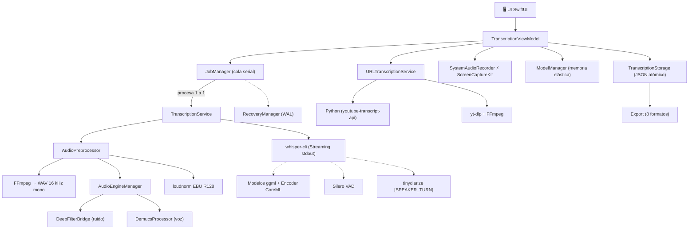

# 🎙️ Transcriptor X

### *Transcription engine nativo de macOS con IA local, aislamiento de voz y diseño de ingeniería de robustez industrial.*

> **Transcriptor X** es una aplicación macOS nativa (SwiftUI) que convierte audio y video en texto con precisión de nivel profesional, ejecutando **el 100% del procesamiento en tu Mac**. Sin nubes, sin APIs de terceros, sin subir un solo byte de tu voz. Bajo el capó orquesta un pipeline completo: limpieza neuronal del audio (DeepFilterNet + Demucs), motor de reconocimiento `whisper.cpp` acelerado por CoreML, diarización de hablantes, cola de trabajos serial con recuperación ante fallos y exportación a 8 formatos.

<p align="center">
  
  
  
  
  
  
  
  
</p>

---

## 📑 Índice

1. [La idea en 30 segundos](#-la-idea-en-30-segundos)
2. [Lo que puede hacer](#-lo-que-puede-hacer)
3. [Cómo funciona por dentro](#-cómo-funciona-por-dentro)
    - [Arquitectura general](#arquitectura-general)
    - [Resolución de un audio paso a paso](#resolución-de-un-audio-paso-a-paso)
    - [Pipeline de preprocesado de audio](#pipeline-de-preprocesado-de-audio)
    - [Motor ASR whisper.cpp](#motor-asr-whispercpp)
    - [Transcripción en vivo (streaming)](#transcripción-en-vivo-streaming)
    - [Cola de trabajos serial](#cola-de-trabajos-serial)
    - [Gestión elástica de memoria del modelo](#gestión-elástica-de-memoria-del-modelo)
    - [Recuperación ante fallos (Write-Ahead Logging)](#recuperación-ante-fallos-write-ahead-logging)
    - [Grabación de micrófono y audio del sistema](#grabación-de-micrófono-y-audio-del-sistema)
    - [Flujo de URLs (YouTube y otros)](#flujo-de-urls-youtube-y-otros)
    - [Persistencia y exportación](#persistencia-y-exportación)
4. [Decisiones de ingeniería](#-decisiones-de-ingeniería)
5. [Stack tecnológico](#-stack-tecnológico)
6. [Modelos de IA soportados](#-modelos-de-ia-soportados)
7. [Instalación](#-instalación)
8. [Organización de datos locales](#-organización-de-datos-locales)
9. [Atajos de teclado](#-atajos-de-teclado)
10. [Privacidad y seguridad](#-privacidad-y-seguridad)
11. [Solución de problemas](#-solución-de-problemas)
12. [Contribución](#-contribución)
13. [Licencias de código abierto](#-licencias-de-código-abierto)

---

## 🚀 La idea en 30 segundos

Grabar una reunión, una clase o una entrevista produce **horas de audio** y cero texto aprovechable. La mayoría de soluciones suben esas grabaciones a la nube — con todas las implicaciones de privacidad que eso conlleva — y aún así devuelven texto sin timestamps, sin diferenciar hablantes y sin limpiar el ruido de fondo.

**Transcriptor X** ataca el problema de raíz:

- 🧠 **IA local de última generación** — el motor `whisper.cpp` en tu propia máquina, acelerado por el Apple Neural Engine vía encoders CoreML.
- 🧹 **Audio limpio antes de transcribir** — un preprocesado en cascada con redes neuronales de reducción de ruido (DeepFilterNet) y aislamiento de voz (Demucs), más normalización de volumen EBU R128.
- 🗣️ **Diarización** — sabe *quién* habló (Hablante 1, Hablante 2…), con timestamps por segmento.
- 🔴 **Graba desde el propio sistema** — captura el audio *interno* de tu Mac (reuniones, videos, juegos) gracias a `ScreenCaptureKit`.
- 🛡️ **100% local** — tus conversaciones nunca salen de tu disco.

---

## ✨ Lo que puede hacer

| Capacidad | Detalle |
|---|---|
| 🎙️ **Transcripción universal** | Archivos locales (`.mp3`, `.wav`, `.m4a`, `.mp4`, `.mov`, `.flac`, `.ogg`…) y cualquier contenedor que FFmpeg entienda. |
| 🔴 **Grabación integrada** | Micrófono del sistema **y** audio interno del Mac (audio del sistema vía `ScreenCaptureKit`). Gestos: grabar, pausar, reanudar, cancelar. |
| 🌐 **Flujo de URLs** | Pega un enlace: usa `youtube-transcript-api` para subtítulos instantáneos o, si la transcripción no existe, descarga el audio con `yt-dlp` y lo transcribe localmente. Soporta YouTube y otros dominios. |
| 🧹 **Limpieza neuronal** | **DeepFilterNet** para eliminar ruido + **Demucs** para aislar la voz de la música de fondo (separación de stems). |
| 🔊 **Normalización de volumen** | EBU R128 (`loudnorm`, I=-16 LUFS) para que el ASR escuche señales consistentes. |
| ⚙️ **Control fino del ASR** | Beam size, temperatura, umbrales de entropía y de no-discurso, VAD Silero configurable, prompts de arranque, traducción automática, timestamps. |
| 🗣️ **Diarización de hablantes** | Integración con **tinydiarize** (`-tdrz`) dentro de whisper.cpp: marca `[SPEAKER_TURN]` → etiquetas de hablante por segmento. |
| 💾 **8 formatos de exportación** | `.txt`, `.srt`, `.vtt`, `.md`, `.csv`, `.html`, `.pdf`, `.docx` — todos generados desde una representación intermedia común. |
| ✏️ **Editor de transcripción** | Visor interactivo con timestamps: editar texto, deshacer ediciones, restaurar el original, marcar favoritos, ocultar segmentos, buscar. |
| 🧩 **Presets** | *Conferencia*, *Podcast*, *Entrevista*: combinaciones de modelo, idioma, VAD y diariazación con un clic. |
| 🛡️ **Recuperación ante fallos** | Sistema tipo Write-Ahead Logging: si el Mac se apaga a mitad de una grabación o transcripción, lo recuperas en el siguiente arranque. |
| 📦 **Instalador nativo** | DMG «arrastra a Aplicaciones» generado por script propio con fondo localizado y atajos de Finder. |

---

## 🧠 Cómo funciona por dentro

### Arquitectura general

```
┌─────────────────────────────────────────────────────────────────────┐
│                          CAPA DE INTERFAZ                           │
│     SwiftUI + Combine (MVVM)  ·  pantalla mín. 900×600              │
│                                                                     │
│   ┌──────────┐  ┌──────────────┐  ┌──────────────┐  ┌────────────┐ │
│   │ MasterView│ │   SetupView   │ │ Preferences  │ │ Recorder UI │ │
│   │ (historial)│ │ (inst. deps) │ │   (ajustes)   │ │  (flotante) │ │
│   └──────────┘  └──────────────┘  └──────────────┘  └────────────┘ │
└───────────────┬─────────────────────────────────────────────┬──────┘
                │ ViewModel (TranscriptionViewModel)           │ Recovery UI
┌───────────────▼─────────────────────────────────────────────▼──────┐
│                        DOMINIO / SERVICIOS                          │
│                                                                     │
│  TranscriptionViewModel ──► JobManager (cola serial de trabajos)   │
│                                  │                                  │
│   ┌──────────────────────────────┼─────────────────────────────┐   │
│   │  TranscriptionService         │  AudioPreprocessor          │   │
│   │   (whisper-cli + CoreML + VAD)│   (FFmpeg → WAV 16 kHz)     │   │
│   │                              │    │                        │   │
│   │                              │    ├─► AudioEngineManager    │   │
│   │                              │    │     ├─ DeepFilterBridge │   │
│   │                              │    │     └─ DemucsProcessor  │   │
│   │                              │    └─► loudnorm (EBU R128)   │   │
│   └──────────────────────────────┴─────────────────────────────┘   │
│                                                                     │
│  URLTranscriptionService ──► Python (youtube-transcript-api / yt-dlp)│
│  SystemAudioRecorder   ─────► ScreenCaptureKit (audio del sistema) │
│  RecorderManager       ─────► AVFoundation (micrófono)             │
│  ModelManager          ─────► memoria elástica del modelo IA       │
│  RecoveryManager       ─────► Write-Ahead Logging (manifiestos)    │
│  TranscriptionStorage  ─────► JSON atómico (historial)             │
└─────────────────────────────────────────────────────────────────────┘
```

Y su equivalente en el mundo real de los servicios:



### Resolución de un audio paso a paso

Cuando el usuario arrastra un `.mp4` y pulsa *Transcribir*, la aplicación ejecuta esta cadena:

```
  1. ENCOLADO        JobManager.snapshot: congela TranscriptionSettings en el momento de
                     encolar (dominio inmutable del trabajo). El worker es SERIAL: solo
                     hay una transcripción activa, lo que acota RAM/GPU y evita degradar
                     el sistema con cargas paralelas.

  2. PREPROCESADO    0 % ───────────────────────────► 30 %
     (AudioPreprocessor)
        a) FFmpeg: extrae pista y convierte a WAV 16 kHz / mono / PCM s16le.
        b) (opc.) DeepFilterNet: elimina ruido de fondo.
        c) (opc.) Demucs (HTDemucs): aísla la voz de la música.
        d) (opc.) FFmpeg loudnorm I=-16:TP=-1.5:LRA=11 (EBU R128).

  3. ASR              30 % ──────────────────────────► 100 %
     (TranscriptionService)
        a) Asegura modelo IA (descarga progresiva o uso de cache-local).
        b) Prepara CoreML encoder (activa/desactiva renombrando a .off) y VAD Silero.
        c) Si idioma = "auto", ejecuta --detect-language primero.
        d) Lanza whisper-cli con los parámetros exactos del job (ver tabla).
        e) Lee pipes: sintaxis de progreso (progress = NN%) y segmentos JSON en vivo.
        f) Reconstruye TranscriptionResult, aplicando diarización (speakers).
```

### Pipeline de preprocesado de audio

El orden **importa** y está documentado en el código. `AudioPreprocessor` compone las
operaciones y las ejecuta sobre un directorio temporal (`transcriptor_<UUID>`) para
nunca tocar el archivo original:

| Paso | Herramienta | Parámetros | Propósito |
|---|---|---|---|
| 1 | `ffmpeg` | `-ar 16000 -ac 1 -c:a pcm_s16le` | Señal limpia y estándar para Whisper (16 kHz mono). |
| 2 | `DeepFilterNet` (`deep-filter`) | binario Rust, atenuación configurable | Elimina ruido estacionario y no estacionario. |
| 3 | `Demucs` (`demucs-bundled`) | modelo `htdemucs`, device `mps` (Apple Silicon) / `cpu`, `--shifts 1 --overlap 0.25` | Separa la pista de voz (stems), útil con música de fondo. |
| 4 | `ffmpeg loudnorm` | `I=-16:TP=-1.5:LRA=11` | Volumen consistente según especificación EBU R128. |

> **El detalle de ingeniería que marca la diferencia:** Demucs empaqueta **Python +
> PyTorch + torchaudio + modelo** en un único binario PyInstaller (`demucs-bundled`) para
> que el usuario nunca tenga que gestionar un entorno de Python. Se descarga con
> `scripts/fetch_binaries.sh` desde los Releases. DeepFilterNet es un binario Rust
> nativo (`deep-filter`) igual de autocontenido.

### Motor ASR whisper.cpp

`TranscriptionService` traduce cada job a una invocación precisa de **whisper-cli**
(compilado con `-DWHISPER_COREML=1` para activar los encoders CoreML). Véase el mapeo:

| Ajuste de la App | Flag de whisper-cli |
|---|---|
| Modelo seleccionado | `-m <modelo>` |
| Idioma / auto-detección | `-l auto` + `--detect-language` |
| Prompt de arranque | `--prompt` |
| Timestamps | `-pp` |
| Temperatura (0.0 = determinista) | `-temperature` |
| Beam search | `-beam-size 5` / `-best-of 5` |
| Umbral de entropía (anti-alucinación) | `-entropy-thold 2.40` |
| Umbral de no-discurso | `-no-speech-thold 0.60` |
| Supresión de segmentos no-fonéticos | `-suppress-nst` |
| Diarización (hablantes) | `-tdrz` (tinydiarize) |
| VAD Silero | `--vad --vad-model --vad-threshold --vad-min-silence-duration-ms --vad-min-speech-duration-ms --vad-speech-pad-ms` |
| Salida JSON legible por la app | `-oj -of <base>` |

**El modelo se gestiona de forma elástica** (véase *[memoria elástica](#gestión-elástica-de-memoria-del-modelo)*).

### Transcripción en vivo (streaming)

Nada de esperar al final: la app **parsea la salida estándar de whisper-cli mientras corre**:

- Se abren pipes sobre el proceso (`readabilityHandler`).
- Una regex captura cada segmento:

```swift
let segmentPattern = /\[(\d\d:\d\d:\d\d\.\d{3})\s*-->\s*(\d\d:\d\d:\d\d\.\d{3})\]\s*(.+)/
```

- El progreso se lee del stderr (`progress = NN%`) y el texto del stdout, alimentando en
  tiempo real la UI (`streamingText` del job).
- 💀 **Cancelación real:** `SIGTERM` al proceso (whisper-cli sale con 15 → job `cancelled`),
  con el preprocesador cancelado en paralelo.
- **Diarización:** los marcadores `[SPEAKER_TURN]` de tinydiarize incrementan el índice de
  hablante; cada segmento final guarda su `speaker` (0, 1, 2…).

### Cola de trabajos serial

`JobManager` es el orquestador maestro:

- Encola **n** audio/video (arrastre múltiple desde Finder) y los procesa **uno a uno** con
  un worker asíncrono (`processQueue` → `while let nextJob = queuedJobs.first`).
- **Por qué es serial (y no paralelo):** cada transcripción carga el modelo en RAM/GPU.
  Transcribir 5 archivos en paralelo multiplicaría el pico de memoria. La cola acota el
  coste a **un modelo cargado a la vez** —una decisión deliberada de robustez de sistema.
- Cada job tiene su **propio snapshot**: los ajustes quedan congelados al encolar, congelando
  el comportamiento aunque el usuario cambie opciones a mitad de procesamiento.
- Gestión por estado: `queued → processing → completed | failed | cancelled`, con `retry`
  (hasta 3 intentos), `progress`, `streamingText` y `stats` agregadas de la cola.
- Al completar: persiste la transcripción en el historial y, si se pidió, conserva el audio.

### Gestión elástica de memoria del modelo

`ModelManager` implementa un patrón de **memoria elástica**:

- **Lazy load:** el modelo solo se carga cuando se necesita.
- **Idle timeout:** si la app no transcribe durante **5 minutos**, el modelo se descarga
  (libera RAM/GPU).
- **Background:** al pasar la app a segundo plano, el timeout se acorta a **60 segundos**.
- **Presión de memoria:** el observador de `NSProcessInfo` descarga el modelo ante avisos
  de presión del sistema y al cambiar el estado de energía.
- Estados: `unloaded → loading(progress) → ready → unloading → error`.

| Modelo | RAM/GPU estimada |
|---|---:|
| tiny | ~75 MB |
| base | ~150 MB |
| small | ~500 MB |
| medium | ~1.5 GB |
| large* | ~3 GB |

### Recuperación ante fallos (Write-Ahead Logging)

La ingeniería de robustez más exigente del proyecto. `RecoveryManager` (un `actor` Swift)
escribe **manifiestos JSON *antes*** de iniciar cualquier operación:

```
Manifests/
├── recording-<id>.json        ← RecordingManifest
└── transcription-<id>.json    ← TranscriptionManifest
```

- **Grabando:** el manifiesto se crea *antes* de abrir el stream de audio
  (`status: recording → finalizing → completed/interrupted`), con progresión periódica
  (`durationAtLastUpdate`). El audio vive en `TempRecordings/`.
- **Transcribiendo:** el manifiesto guarda el modelo y, críticamente, **segmentos parciales**
  (`PartialSegment{start, end, text, speaker}`) que se van añadiendo con cada actualización.
- **En el arranque:** `checkForRecoverableItems()` detecta manifiestos huérfanos →
  mueve el audio a `Recovered/recovered_<id>.wav`, guarda el texto parcial en
  `recovered_<id>.txt` y avisa al usuario con una notificación. **Nada se pierde.**

### Grabación de micrófono y audio del sistema

- **Micrófono:** pipelines de `AVFoundation` con máquina de estados explícita
  (`RecordingState`): `idle → requestingPermission → preparingAudio → initializingCapture →
  recording → paused → stopping → saving → completed`.
- **Audio del sistema:** registrar *lo que suena en tu Mac* (una reunión en el navegador,
  una clase grabada en streaming…) se hace con `ScreenCaptureKit`, la API de Apple que
  captura el audio interno del dispositivo. Requiere el permiso de *Grabación de pantalla*.
- El panel de grabación es un **floating panel** (ventana flotante) que permite pausar,
  parar y ver duración sin salir de la app; el audio grabado entra directo en la misma cola
  de transcripción.

### Flujo de URLs (YouTube y otros)

1. `URLDispatcher` valida la URL, limpia parámetros de seguimiento (conserva `v`, `t`,
   `start`, `end`) y reconoce la plataforma (YouTube en todas sus variantes:
   `watch?v=`, `embed`, `shorts`, `youtu.be`, `m.` y `nocookie`; además TikTok, Instagram,
   Vimeo, Twitter/X…).
2. **Modo transcripción instantánea:** para YouTube usa `youtube-transcript-api`, con
   prioridad de idioma `es → en`, prefiriendo transcripciones manuales sobre las
   autogeneradas, y agrupando párrafos con heurística de fin de frase.
3. **Sin subtítulos disponibles:** el mismo flujo cae en `yt-dlp` (+ `FFmpegExtractAudio`,
   m4a 192 kbps, sin playlists), descarga el audio y **lo transcribe localmente** con el
   mismo pipeline. Así, el resultado de un enlace siempre es texto para editar/exportar.

### Persistencia y exportación

- **Historial:** `TranscriptionStorage` escribe `transcriptions.json` de forma **atómica**
  (pretty-printed, claves ordenadas, fechas ISO8601) y notifica cambios
  (`transcriptionsDidChange`). Los audios conservados viven en `/audio/`.
- **Exportación inteligente:** toda salida nace de una **representación intermedia** —
  `ExportDocument` (título, duración, idioma, modelo, hablantes, timestamps, segmentos con
  favoritos). De ahí se derivan **los 8 formatos** sin duplicar lógica:

```
ExportDocument (IR neutral)
   ├── .txt   → texto plano
   ├── .srt   → subtítulos con [Hablante N] y HH:MM:SS,mmm
   ├── .vtt   → WEBVTT con <v Hablante N>
   ├── .md    → Markdown con ## Hablante N y timestamps en negrita
   ├── .csv   → filas por segmento
   ├── .html  → documento autocontenido
   ├── .pdf   → renderizado y empaquetado
   └── .docx  → zip OOXML con la estructura Word
```

- **Visor interactivo (`TranscriptViewer`):** los segmentos se editan, marcan como
  favoritos, se ocultan o se restauran (historial de ediciones + `originalText`), con
  búsqueda integrada y acceso rápido a exportar.

---

## 🏆 Decisiones de ingeniería

Decisiones deliberadas, con su *porqué*, para que se note el nivel de diseño:

| Decisión | Por qué |
|---|---|
| **Cola de transcripción serial** | Acotar el pico de RAM/GPU a un único modelo cargado evita degradar el sistema y hace el progreso predecible para el usuario. |
| **Snapshot inmutable en cada job** | Cada trabajo se comporta idéntico sea cual sea el estado de los ajustes durante su ejecución → resultados reproducibles. |
| **Write-Ahead Logging antes de operar** | El manifiesto se escribe *antes* de la acción: es la única forma de garantizar recuperación ante un corte de energía a mitad de grabación. |
| **Preprocesado en cascada (FFmpeg → DeepFilter → Demucs → loudnorm)** | El ASR rinde mejor con señales limpias, mono y con volumen estable; la cadena se ejecuta sobre una copia temporal, el original jamás se altera. |
| **Encoders CoreML + whisper.cpp nativo** | Inferencia en el Apple Neural Engine: transcripción ultrarrápida y térmicamente eficiente frente a modelos puros de CPU/GPU. |
| **Representación intermedia para exportación** | 8 formatos con una sola fuente de verdad → la lógica de contenido no se duplica por formato. |
| **Binarios autocontenidos (PyInstaller/Rust)** | El usuario final nunca gestiona entornos Python para Demucs ni toolchains para DeepFilterNet. |
| **`os.log` + exportación de diagnósticos** | Logging estructurado a nivel sistema y un botón en el menú *Ayuda* que exporta logs para soporte. |

---

## 🛠️ Stack tecnológico

| Capa | Tecnología |
|---|---|
| **Lenguaje / UI** | Swift 5 · SwiftUI · Combine · `os.log` |
| **Multimedia / sistema** | `AVFoundation` · `CoreAudio` · `ScreenCaptureKit` (audio del sistema) |
| **Red** | `URLSession` (descargas con resume + delegado) |
| **ASR** | `whisper.cpp` / `whisper-cli` + encoders **CoreML** (`ggml-<modelo>-encoder.mlmodelc`) |
| **VAD** | Silero VAD (`ggml-silero-v6.2.0.bin`) |
| **Diarización** | tinydiarize (`-tdrz`) |
| **Preprocesado** | FFmpeg · DeepFilterNet (`deep-filter`, Rust) · Demucs (`demucs-bundled`, PyInstaller + PyTorch) · loudnorm EBU R128 |
| **Flujos remotos** | Python 3 · `youtube-transcript-api` · `yt-dlp` |
| **Persistencia** | JSON atómico (ISO8601) + estructura de archivos en `Application Support` |
| **Build / empaquetado** | Xcode · xcodebuild · CMake (`-DWHISPER_COREML=1`) · Homebrew · `scripts/build_dmg.py` + `scripts/make_background.swift` (DMG «arrastra a Aplicaciones») |

---

## 🧠 Modelos de IA soportados

La descarga y gestión de modelos es totalmente integrada (progreso, reanudación y CoreML
incluido en la app):

| ID | Nombre en App | Peso | Encoder CoreML | Uso recomendado |
|---|---|---|---|---:|
| `tiny` | Ultra Rápido | 75 MB | 24 MB | Pruebas y dictado |
| `base` | Rápido | 142 MB | 43 MB | Notas rápidas (recomendado por defecto) |
| `small` | Equilibrado | 466 MB | 134 MB | Entrevistas sencillas / clases |
| `medium` | Preciso | 1.5 GB | 391 MB | Nivel profesional |
| `large-v3-turbo` | Profesional | 1.6 GB | 475 MB | Velocidad superior con gran calidad |
| `large-v2` | Large V2 | 2.9 GB | 636 MB | Archivos con tendencia a alucinaciones |
| `large-v3` | Máxima Calidad | 2.9 GB | 636 MB | Precisión total multi-lenguaje |

---

## 📦 Instalación

### Requisitos mínimos

- **macOS 13.0 (Ventura)** o posterior.
- **Apple Silicon (M1/M2/M3/M4)** altamente recomendado para aprovechar los encoders CoreML
  del Neural Engine (también funciona en Intel con backend CPU).

### Quick start

#### Opción 1 — Compilar con Xcode *(recomendada para desarrollo)*

1. Abre `TranscriptorNative.xcodeproj` en Xcode 14+.
2. Esquema `TranscriptorNative` → destino `My Mac`.
3. `Cmd + R`. El primer arranque abre el **Setup** que instala las dependencias
   automáticamente con progreso en vivo (Homebrew → FFmpeg → whisper.cpp).

#### Opción 2 — Compilar por CLI

```bash
xcodebuild -project TranscriptorNative.xcodeproj \
  -scheme TranscriptorNative \
  -configuration Release \
  -destination 'platform=macOS' \
  -derivedDataPath ./DerivedData-CI \
  build

open "./DerivedData-CI/Build/Products/Release/TranscriptorNative.app"
```

#### Opción 3 — DMG «arrastra a Aplicaciones» *(para usuarios finales)*

Descarga `TranscriptorX-2.0.dmg` desde **[Releases](https://github.com/alexbernaldo/TranscriptorX/releases)**,
ábrelo con doble clic y **arrastra el icono a Aplicaciones** (el fondo del disco te indica
exactamente hacia dónde, con texto localizado en español/inglés). En máquinas distintas de
la de desarrollo, macOS pedirá confirmación al ser una app sin notarización: botón derecho →
*Abrir* → *Abrir* (solo la primera vez).

Para regenerar el DMG tras compilar:

```python
python3 scripts/build_dmg.py \
  --app DerivedData-CI/Build/Products/Release/TranscriptorNative.app \
  --output dist/TranscriptorX-2.0.dmg
```

*(El script monta la imagen, aplica el diseño del Finder vía AppleScript y genera el fondo
con `make_background.swift`.)*

### Dependencias de medios y motor

Si prefieres configurarlas a mano en lugar de usar el Setup:

```bash
# Homebrew
/bin/bash -c "$(curl -fsSL https://raw.githubusercontent.com/Homebrew/install/HEAD/install.sh)"

# Herramientas de medios
brew install ffmpeg yt-dlp python3

# whisper.cpp con soporte CoreML
mkdir -p "$HOME/Library/Application Support/Transcriptor"
cd "$HOME/Library/Application Support/Transcriptor"
git clone https://github.com/ggerganov/whisper.cpp.git
cd whisper.cpp
cmake -B build -DWHISPER_COREML=1
cmake --build build --config Release -j
```

Herramientas de audio opcionales (DeepFilterNet y Demucs) vienen como binarios de los
Releases:

```bash
./scripts/fetch_binaries.sh   # descarga demucs-bundled y deep-filter → TranscriptorNative/AudioEngine/lib
```

---

## 📂 Organización de datos locales

```
~/Library/Application Support/
├── Transcriptor/
│   ├── whisper.cpp/      ← motor + pesos ggml + encoders CoreML + Silero VAD
│   ├── Logs/             ← logs estructurados (os.log, exportables desde el menú Ayuda)
│   ├── Recovered/        ← recuperaciones automáticas (audio y texto parcial)
│   ├── Manifests/        ← Write-Ahead Logging (registros de sesión en curso)
│   └── TempRecordings/   ← grabaciones en curso
└── TranscriptorNative/
    ├── transcriptions.json  ← historial (escritura atómica, ISO8601)
    └── audio/            ← audios conservados del historial
```

---

## ⌨️ Atajos de teclado

| Atajo | Acción |
|---|---|
| `Cmd + N` | Nueva transcripción |
| `Cmd + O` | Abrir archivo de audio/video |
| `Cmd + R` | Iniciar / grabar |
| `Cmd + F` | Búsqueda en el transcript |
| `Shift + Cmd + C` | Copiar transcripción completa |
| `Cmd + Opt + Z` | Deshacer última edición de segmento |
| `Cmd + Opt + R` | Restaurar el texto original de un segmento |
| *Menú Ayuda* | Exportar diagnósticos · Liberar memoria del modelo · Ver modelo cargado y RAM |

---

## 🔒 Privacidad y seguridad

- **100% de procesamiento en local.** Los únicos bytes que salen de tu máquina son las
  descargas (modelos, URLs de YouTube y dependencias).
- **Sin cuentas, sin telemetría, sin anuncios.**
- Permisos macOS usados únicamente para sus funciones: micrófono (grabar), grabación de
  pantalla (audio del sistema) y archivos que el propio usuario abre.
- Licencia de los componentes de terceros documentada en `THIRD_PARTY_NOTICES.md` y
  `licenses/` (ver sección final).

---

## ⚠️ Solución de problemas

| Síntoma | Solución |
|---|---|
| **whisper.cpp no responde** | Ejecuta el Setup desde la UI (instala/compila con `-DWHISPER_COREML=1`) o reconstruye manualmente (sección de dependencias). |
| **Fallo de `yt-dlp` / Python** | Comprueba que `/opt/homebrew/bin/python3` esté en `$PATH` y ejecuta `python3 -m pip install youtube-transcript-api`. |
| **No captura audio del sistema** | Sist. Preferencias → Privacidad y seguridad → *Grabación de pantalla* → concede acceso a Transcriptor X y reinicia la app. |
| **DeepFilter / Demucs fallan** | Verifica en `AudioEngine/lib` binarios ARM64 con `chmod +x` (descárgalos con `scripts/fetch_binaries.sh`). |

---

## 🤝 Contribución

1. Haz *fork* y crea una rama con prefijo semántico (`feat/`, `fix/`).
2. Mantén la separación de capas **UI / Services / Dominio** (patrón del proyecto).
3. Documenta cambios de comportamiento en `docs/heuristics-checklist.md` antes del PR.
4. Excluye binarios pesados y artefactos (`/DerivedData`, `__pycache__`, `dist/`) del commit.
5. Abre el PR desde `.github/PULL_REQUEST_TEMPLATE.md` e incluye captura si toca UI.

Guías de diseño y UX disponibles en [`docs/`](docs/): `user-flow.md`,
`information-architecture.md`, `ux-copy-styleguide.md`, `ux-copy-audit.md`.

---

## 📄 Licencias de código abierto

La aplicación se distribuye bajo **PolyForm Noncommercial 1.0.0** (véase `LICENSE`).
Los componentes de terceros y sus licencias están inventariados en
[`THIRD_PARTY_NOTICES.md`](THIRD_PARTY_NOTICES.md) y `licenses/`
(DeepFilterNet, Demucs, PyTorch, torchaudio, whisper.cpp, yt-dlp, youtube-transcript-api,
FFmpeg, Silero VAD, Homebrew…).