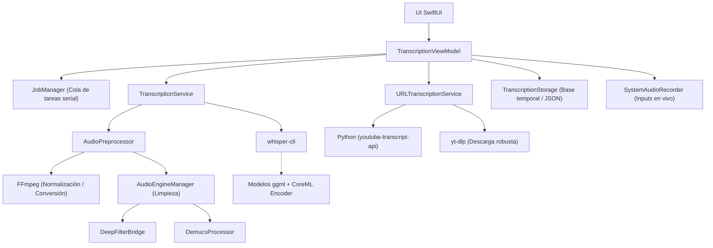

# Transcriptor X (TranscriptorNative)

<p align="center">
  
  
  
  
</p>

---

## 📖 Descripción General

**Transcriptor X** (internamente *TranscriptorNative*) es una potente aplicación nativa para macOS diseñada para la transcripción avanzada de audio y video. Construida con **SwiftUI**, la aplicación ofrece una interfaz intuitiva para usuarios no técnicos, al tiempo que expone un pipeline de procesamiento profundo y parametrizable para usuarios avanzados.

Su principal objetivo es ofrecer transcripciones de alta calidad ejecutadas **100% de forma local**, garantizando la privacidad absoluta de los datos. Se basa en el motor `whisper.cpp` y ofrece aceleración opcional mediante el **Apple Neural Engine (CoreML)**.

---

## ✨ Funcionalidades Principales

Transcriptor X no es solo un transcriptor de Whisper básico; es una suite completa de procesamiento de audio e IA:

- **🎙️ Transcripción Universal:** Transcribe archivos de audio/video locales (`.mp3`, `.wav`, `.m4a`, `.mp4`, `.mov`, etc.).
- **🔴 Grabación Integrada:** Captura audio directamente desde el micrófono o graba el **audio del sistema** nativamente (vía `ScreenCaptureKit`).
- **🌐 Flujo de URLs (YouTube):** Pega un enlace de YouTube para descargar automáticamente subtítulos existentes o descargar el audio (`yt-dlp`) y transcribirlo localmente con Whisper.
- **🧹 Procesamiento de Audio Avanzado (Limpieza y Aislamiento):**
  - **Reducción de Ruido:** Soporte para `DeepFilterNet` para limpiar audios ruidosos antes de transcribir.
  - **Aislamiento de Voz:** Integración con `Demucs` para separar pistas y extraer únicamente las voces aislando música de fondo.
  - **Normalización EBU R128:** Estandarización de volumen manejada automáticamente por `FFmpeg`.
- **⚙️ Parametrización Avanzada:** Control total sobre los parámetros de generación de Whisper (VAD en múltiples niveles, Beam Size, umbrales de entropía, etc.).
- **💾 Exportación Multi-formato:** Soporta exportaciones en Texto plano (`.txt`), Subtítulos (`.srt` y `.vtt`), y Markdown (`.md`).
- **🛡️ 100% Privado y Local:** Todo el procesamiento (excepto descargas de YouTube) ocurre en tu Mac. Sin APIs de terceros.
- **🗂️ Historial y Persistencia:** Recuperación ante fallos del sistema o cierres inesperados; todo el historial de transcripciones se guarda automáticamente.

---

## 🛠️ Stack Tecnológico y Arquitectura

La arquitectura de la aplicación separa claramente la capa visual (UI) de los servicios de procesamiento, orquestados mediante un sistema eficiente de colas.

### Core App (Frontend & Lógica)
- **Lenguaje:** Swift 5.
- **Framework UI:** SwiftUI (Interfaces declarativas modernas) y Combine (Estado reactivo).
- **Redes y Descargas nativas:** `URLSession` para manejo de peticiones HTTP nativas.
- **Gestor de Audio (Nivel OS):** `AVFoundation`, `CoreAudio` y `ScreenCaptureKit`.
- **Registro de Eventos:** `os.log` para logging estructurado interno a nivel sistema.

### Subsistema de Audio y Motor ASR (Inteligencia Artificial)
- **whisper.cpp & whisper-cli:** Motor principal de alta velocidad optimizado para Mac.
- **CoreML Encoders:** Modelos pre-calculados para acelerar las transcripciones usando la NPU/GPU de Apple Silicon (`ditto` usado para su descompresión).
- **FFmpeg:** Framework multifunción utilizado para la extracción de canales, conversión (WAV 16kHz mono) y normalización.
- **Silero VAD (Voice Activity Detection):** Detección inteligente de actividad vocal integrada opcionalmente en la ejecución del CLI.

### Flujos Remotos e Integraciones Externas
- **Python 3:** Usado internamente mediante scripts invocados por la app para resolución de metadatos.
- **youtube-transcript-api:** Extracción ultrarrápida de subtítulos cerrados de ecosistemas web como YouTube.
- **yt-dlp:** Descarga robusta y de alta calidad de flujos de medios remotos.

### Herramientas de Audio de Vanguardia (Opcionales)
- **DeepFilterNet (`deep-filter`):** Binario optimizado para eliminación de ruido mediante redes neuronales.
- **Demucs (`demucs-bundled`):** Separador de pistas de audio empaquetado para ejecución rápida en entornos arm64.
- **Ecosistema IA de Demucs:** Requiere herramientas Python avanzadas con dependencias clave explícitas: `torch` (PyTorch), `torchaudio`, `coremltools` (para la migración de PyTorch a modelos NPU) y `numpy`.

### Herramientas de Construcción y Desarrollo
- **Xcode & xcodebuild:** Entorno de compilación, orquestador e interfaz del empaquetado base (`.xcodeproj`).
- **CMake:** Sistema cruzado utilizado para la compilación profunda del motor C/C++ de `whisper.cpp`.
- **Homebrew:** Gestor de paquetes primario en macOS usado para delegar la instalación de dependencias nativas.

---

## 🏗️ Arquitectura de la Aplicación

El sistema está diseñado en bloques desacoplados. Se implementó un "JobManager" serializado para evitar bloquear el hilo principal y prevenir picos extremos de uso de memoria (RAM / GPU) al lanzar múltiples transcripciones en paralelo.



---

## 📥 Requisitos del Sistema e Instalación

### Requisitos Mínimos
- **Sistema Operativo:** macOS 13.0 (Ventura) o posterior.
- **Hardware:** Mac con procesador Apple Silicon (M1/M2/M3) altamente recomendado para el rendimiento óptimo de los CoreML encoders.

### Quick Start / Instalación

#### Opción 1: Compilación local vía Xcode (Recomendada)
1. Abre el archivo `TranscriptorNative.xcodeproj` usando Xcode 14 o superior.
2. Selecciona el esquema `TranscriptorNative` apuntando a la ejecución en `My Mac`.
3. Presiona `Cmd + R` para compilar y lanzar la aplicación.
4. En el primer inicio, entrarás al flujo inicial (Setup) de la interfaz gráfica que te ayudará a instalar las dependencias subyacentes fundamentales (`Homebrew`, `FFmpeg`, `whisper.cpp`).

#### Opción 2: Compilación manual interactiva vía CLI
```bash
# Compila el ejecutable del proyecto usando las Command Line Tools
xcodebuild -project TranscriptorNative.xcodeproj \
  -scheme TranscriptorNative \
  -configuration Debug \
  -destination 'platform=macOS' \
  -derivedDataPath ./DerivedData-CI \
  build

# Abre y ejecuta la aplicación macOS empacada
open "./DerivedData-CI/Build/Products/Debug/TranscriptorNative.app"
```

#### Construcción Manual de Dependencias
Si configuras tu sistema local manualmente y prefieres omitir el instalador in-app:

```bash
# 1. Instalar Homebrew si el sistema carece de este package-manager
/bin/bash -c "$(curl -fsSL https://raw.githubusercontent.com/Homebrew/install/HEAD/install.sh)"

# 2. Instalar binarios de manipulación de medios
brew install ffmpeg yt-dlp python3

# 3. Descargar y compilar Whisper.cpp habilitando su soporte para Apple CoreML
mkdir -p "$HOME/Library/Application Support/Transcriptor"
cd "$HOME/Library/Application Support/Transcriptor"
git clone https://github.com/ggerganov/whisper.cpp.git
cd whisper.cpp
cmake -B build -DWHISPER_COREML=1
cmake --build build --config Release -j
```

---

## 🧠 Modelos de IA (Whisper)

La aplicación es compatible dinámicamente con múltiples ponderaciones del modelo Whisper oficial ofreciendo un perfecto balance velocidad-acierto.

| ID | Nombre en App | Peso del Modelo | Encoder CoreML (Aprox) | Uso Recomendado |
|---|---|---:|---:|---|
| `tiny` | Ultra Rápido | 75 MB | 24 MB | Pruebas de dictado iniciales |
| `base` | Rápido | 142 MB | 43 MB | Notas rápidas y recordatorios |
| `small` | Equilibrado | 466 MB | 134 MB | Entrevistas sencillas / Clases |
| `medium` | Preciso | 1.5 GB | 391 MB | Transcripción de nivel profesional |
| `large-v3-turbo` | Profesional | 1.6 GB | 475 MB | Velocidad superior a V3 con calidad inmensa |
| `large-v2` | Large V2 | 2.9 GB | 636 MB | Archivos muy propensos a alucinaciones |
| `large-v3` | Máxima Calidad | 2.9 GB | 636 MB | Precisión total e inferencia multi-lenguaje |

---

## 📂 Organización de Datos Locales y Rutas

Diseñado pensando en la permanencia atómica de la información, el historial existe bajo un sistema persistente en la librería local de usuario.

`~/Library/Application Support/Transcriptor/`
- **`/whisper.cpp/`**: Ruta de instalación del motor primario y descarga de pesos preentrenados del modelo IA.
- **`/Logs/`**: Registros estructurados por fecha útiles al realizar un diagnóstico de errores en la máquina host.
- **`/Recovered/`**: Respaldo automático contra padecimientos del sistema o crashes fortuitos.

`~/Library/Application Support/TranscriptorNative/`
- **`transcriptions.json`**: Base de estado central donde los metadatos y resoluciones previas de texto reposan seguras.
- **`/audio/`**: Enlaces o copias procesadas de audios preservados pertenecientes al historial transaccional de texto.

---

## ⌨️ Atajos de Teclado del Sistema

Eficacia y control. Los atajos integrados maximizan la velocidad en usuarios habituales:
- `Cmd + N`: Nueva transacción / transcripción.
- `Cmd + O`: Abrir archivo / Invocar explorador multimedia.
- `Cmd + R`: Iniciar / Pausar flujo de grabación en vivo.
- `Cmd + F`: Activar bloque de búsqueda interno local en texto crudo.
- `Shift + Cmd + C`: Copiar contenido global final transcrito.

---

## ⚠️ Solución de Problemas (Troubleshooting)

| Error Común | Metodología de Resolución |
|---|---|
| **`whisper.cpp no responde / Faltante`** | Valida correr correctamente la etapa de configuración/descarga que aparece en la UI al ejecutarse por primera vez, o reconstruye con el flag CoreML mediante de CMake. |
| **`Fallo local de ytp-dlp / Python 3`** | Asegúrate que las líneas de comandos `/opt/homebrew/bin/python3` están activadas dentro de tu `.zshrc`/`$PATH`, y procede instalando módulos requeridos corriendo: `python3 -m pip install youtube-transcript-api`. |
| **`Grabación de Pantalla no logra captar`**| Accede a *Panel de Preferencias de tu Mac > Privacidad y Seguridad > Grabación de Pantalla y del Sistema*, permítele acceso local total a TranscriptorNative, y ejecuta un refresco (reinicia la app). |
| **`Error de ejecución de DeepFilter / Demucs`**| El directorio contenedor `AudioEngine/lib` debe poseer binarios nativos ARM64 con permisividad de ejecución `chmod +x`. |

---

## 🤝 Contribución y Desarrollo

El ciclo de desarrollo en **Transcriptor X** está en constante dinamismo y valoramos contribuciones abiertas:
1. Haz de antemano un "Fork" desde Git, y define una nueva rama conceptual de trabajo (Ej. `feat/mejor-exportacion`).
2. Mantén coherencia al patrón de inyección de arquitecturas: Aislando siempre capas **UI**, **Services** y flujos lógicos base.
3. Asegurando que tu refactorización no rompe las secuencias lógicas de las macros, y corrobora antes de cualquier PR documentar dichos cambios dentro de `heuristics-checklist.md`.
4. Cerciorate de crear archivos `.gitignore` apropiados y excluir todos los binarios autogenerados o pesados compiladores de entorno como `/DerivedData` antes de efectuar tus commits finales.

**Licencias de Uso:** *Condiciones pendientes por especificar.*
